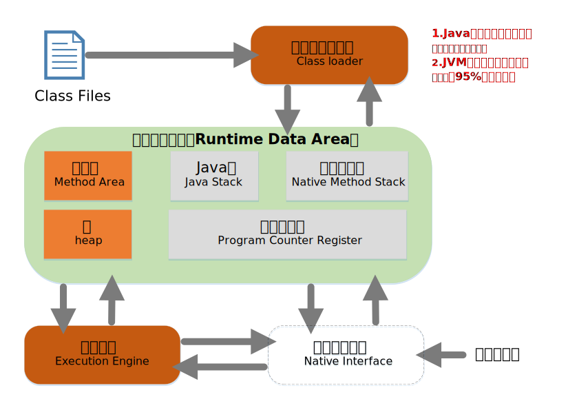
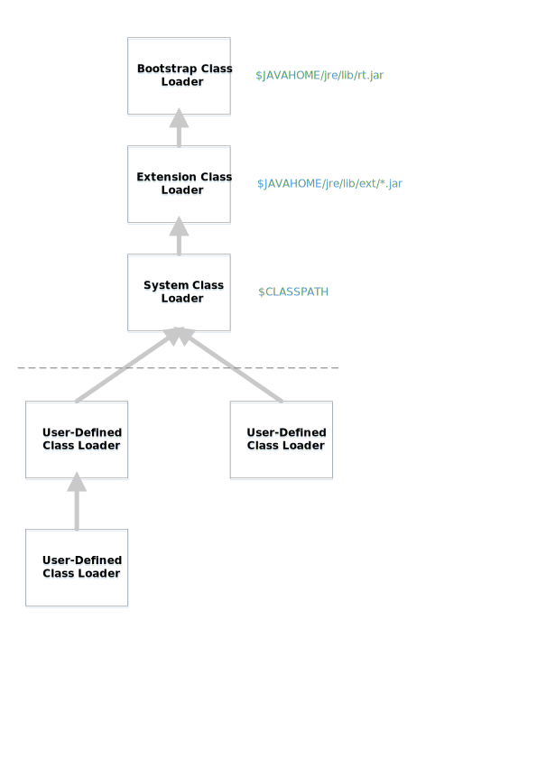

## JVM结构图

### JVM调优
1. Java栈、本地方法栈、程序计数器没有垃圾回收
2. JVM调优是在方法区、堆上调优。95%是堆调优。

### 什么是类装载器 ClassLoader

Java类加载器（Java Classloader）是Java运行时环境（Java Runtime Environment）的一部分，负责动态加载Java类到Java虚拟机的内存空间中。类通常是按需加载，即第一次使用该类时才加载。由于有了类加载器，Java运行时系统不需要知道文件与文件系统。Classloader是一个抽象类，它的实例将读入的java字节码装载到JVM中，可以单独定制，满足不同的字节码流获取方式，主要负责类装载过程中的加载阶段。

大部分java程序会使用以下3中系统提供的类加载器:

- **启动类加载器(Bootstrap ClassLoader)**: 这个类加载器负责将存放在<java_home>\lib目录中的，或者被 -Xbootclasspath参数所指定的路径中的，并且在巡检识别的（仅仅按照文件名识别，如rt.jar，名字不符合的类库即使放在lib目录下也不会被加载）类库加载到虚拟机中。此类加载器并不继承于java.lang.ClassLoader,由原生代码（如C语言）编写，不能被java程序直接调用。

- **扩展类加载器(Extendsion ClassLoader)**: 此类负责加载<java_home>\lib\ext目录中的，或者被java.ext.dirs系统变量所指定的路径的所有类库，开发者可以直接使用扩展类加载器。

- **应用程序类加载器(Application ClassLoader**):　这个类加载器负责加载用户类路径(CLASSPATH)下的类库,一般我们编写的java类都是由这个类加载器加载,这个类加载器是CLassLoader中的getSystemClassLoader()方法的返回值,所以也称为系统类加载器.一般情况下这就是系统默认的类加载器.

- **用户自定义加载器**: Java.lang.ClassLoader的子类，用户可以定制类的加载方式

#### 获取Class类的实例(四种方法)

1. 前提：若已知具体的类，通过类的class属性获取，该方法最为安全可靠，程序性能最高。`实例：Class clazz = String.class;`
2. 前提：已知某个类的实例，调用该实例的getClass()方法获取Class对象。`实例：Class clazz = “www.atguigu.com”.getClass();`
3. 前提：已知一个类的全类名，且该类在类路径下，可通过Class类的静态方法forName()获取，可能抛出ClassNotFoundException。`实例：Class clazz = Class.forName(“java.lang.String”);`
4. 其他方式(不做要求)。`ClassLoader cl = this.getClass().getClassLoader();Class clazz4 = cl.loadClass(“类的全类名”);`

