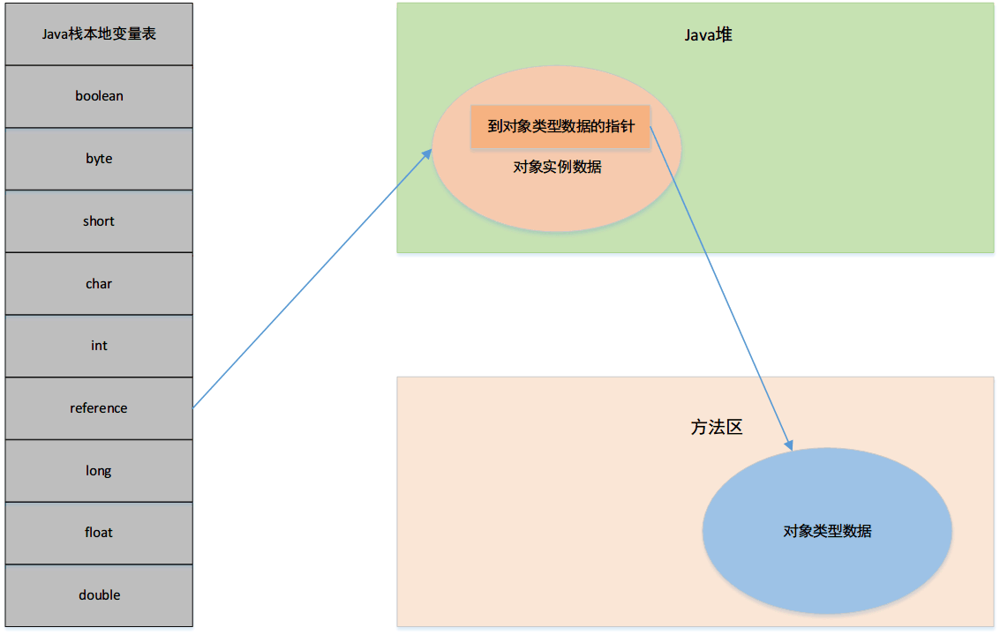
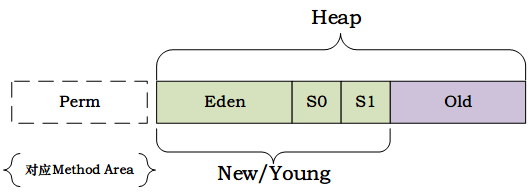
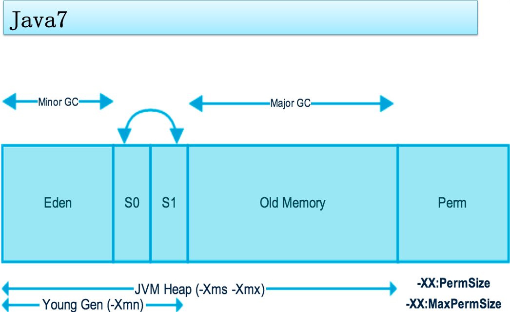
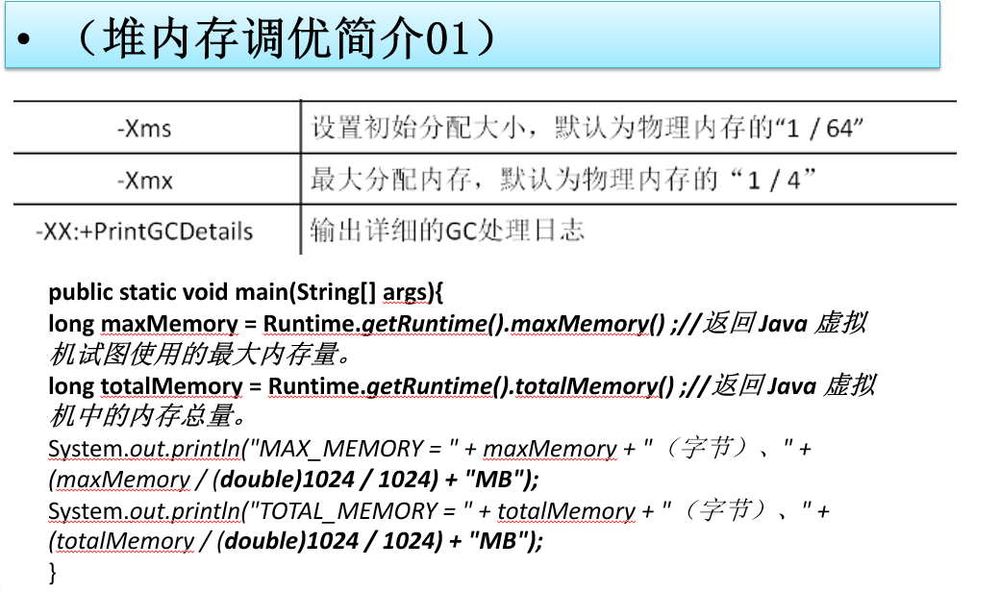
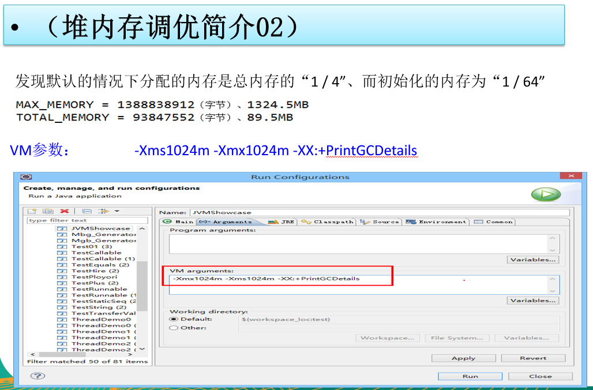

## JVM结构图

JVM：JVM与硬件无关，运行在操作系统之上，与硬件没有直接交互。

### JVM调优
1. Java栈、本地方法栈、程序计数器没有垃圾回收
2. JVM调优是在方法区、堆上调优。95%是堆调优。

### 类加载器ClassLoader

Java类加载器（Java Classloader）是Java运行时环境（Java Runtime Environment）的一部分，负责动态加载Java类到Java虚拟机的内存空间中。类通常是按需加载，即第一次使用该类时才加载。由于有了类加载器，Java运行时系统不需要知道文件与文件系统。Classloader是一个抽象类，它的实例将读入的java字节码装载到JVM中，可以单独定制，满足不同的字节码流获取方式，主要负责类装载过程中的加载阶段。

大部分java程序会使用以下3中系统提供的类加载器:

- **启动类加载器(Bootstrap ClassLoader)**: 这个类加载器负责将存放在<java_home>\lib目录中的，或者被 -Xbootclasspath参数所指定的路径中的，并且在巡检识别的（仅仅按照文件名识别，如rt.jar，名字不符合的类库即使放在lib目录下也不会被加载）类库加载到虚拟机中。此类加载器并不继承于java.lang.ClassLoader,由原生代码（如C语言）编写，不能被java程序直接调用。

- **扩展类加载器(Extendsion ClassLoader)**: 此类负责加载<java_home>\lib\ext目录中的，或者被java.ext.dirs系统变量所指定的路径的所有类库，开发者可以直接使用扩展类加载器。

- **应用程序类加载器(Application ClassLoader**):　这个类加载器负责加载用户类路径(CLASSPATH)下的类库,一般我们编写的java类都是由这个类加载器加载,这个类加载器是CLassLoader中的getSystemClassLoader()方法的返回值,所以也称为系统类加载器.一般情况下这就是系统默认的类加载器.

- **用户自定义加载器**: Java.lang.ClassLoader的子类，用户可以定制类的加载方式

#### 获取Class类的实例(四种方法)

1. 前提：若已知具体的类，通过类的class属性获取，该方法最为安全可靠，程序性能最高。`实例：Class clazz = String.class;`
2. 前提：已知某个类的实例，调用该实例的getClass()方法获取Class对象。`实例：Class clazz = “www.atguigu.com”.getClass();`
3. 前提：已知一个类的全类名，且该类在类路径下，可通过Class类的静态方法forName()获取，可能抛出ClassNotFoundException。`实例：Class clazz = Class.forName(“java.lang.String”);`
4. 其他方式(不做要求)。`ClassLoader cl = this.getClass().getClassLoader();Class clazz4 = cl.loadClass(“类的全类名”);`

#### JVM的双亲委派机制和沙箱安全机制

双亲委派：用户实例化一个类后，JVM的类加载器首先由应用程序类加载器往上抛，经历扩展类加载器到启动类加载器，再从启动类加载器相应的目录下查找类存不存在，不存在往下抛给扩展类加载器查找，以此类推，直到找到为止，如果都没找到则抛出ClassNotFound错误。

沙箱安全机制：如果用户重新定义了启动类加载器、扩展类加载器里自带的类，由于双亲委派机制，JVM会自顶向下的进行类加载，首先会在启动类、扩展类中查找类，避免了用户代码对JVM源代码的污染。

### Native Interface本地接口。

本地接口的作用是融合不同的编程语言为 Java 所用，它的初衷是融合 C/C++程序，Java 诞生的时候是 C/C++横行的时候，要想立足，必须有调用 C/C++程序，于是就在内存中专门开辟了一块区域处理标记为native的代码，它的具体做法是 Native Method Stack中登记 native方法，在Execution Engine 执行时加载native libraies。
目前该方法使用的越来越少了，除非是与硬件有关的应用，比如通过Java程序驱动打印机或者Java系统管理生产设备，在企业级应用中已经比较少见。因为现在的异构领域间的通信很发达，比如可以使用 Socket通信，也可以使用Web Service等等，不多做介绍。

### Native Method Stack本地方法库

它的具体做法是Native Method Stack中登记native方法，在Execution Engine 执行时加载本地方法库。

### 程序计数器（PC寄存器）

每个线程都有一个程序计数器，是线程私有的,就是一个指针，指向方法区中的方法字节码（用来存储指向下一条指令的地址,也即将要执行的指令代码），由执行引擎读取下一条指令，是一个非常小的内存空间，几乎可以忽略不记。

### Method Area 方法区

方法区是被所有线程共享，所有字段和方法字节码，以及一些特殊方法如构造函数，接口代码也在此定义。简单说，所有定义的方法的信息都保存在该区域，此区属于共享区间。 

静态变量+常量+类信息(构造方法/接口定义)+运行时常量池存在方法区中（可能因为这个原因决定了类初始化顺序）

但是实例变量存在堆内存中,和方法区无关

*个人理解：方法区相当于存储了各种类的特征信息，类的模板，一个类有什么样的属性，有什么方法，具体长什么样，都存储再方法区*

## Stack栈

#### Stack栈概念
栈也叫栈内存，主管Java程序的运行，是在线程创建时创建，它的生命期是跟随线程的生命期，线程结束栈内存也就释放，对于栈来说不存在垃圾回收问题，只要线程一结束该栈就Over，生命周期和线程一致，是线程私有的。8种基本类型的变量+对象的引用变量+实例方法都是在函数的栈内存中分配。

#### Stack栈存储内容

栈帧中主要保存3类数据：

*本地变量（Local Variables）*:输入参数和输出参数以及方法内的变量；

*栈操作（Operand Stack）*:记录出栈、入栈的操作；

*栈帧数据（Frame Data）*:包括类文件、方法等等。

#### 栈运行原理：

栈中的数据都是以栈帧（Stack Frame）的格式存在，栈帧是一个内存区块，是一个数据集，是一个有关方法(Method)和运行期数据的数据集，当一个方法A被调用时就产生了一个栈帧 F1，并被压入到栈中，
A方法又调用了 B方法，于是产生栈帧 F2 也被压入栈，
B方法又调用了 C方法，于是产生栈帧 F3 也被压入栈，
……
执行完毕后，先弹出F3栈帧，再弹出F2栈帧，再弹出F1栈帧……

遵循“先进后出”/“后进先出”原则。

### Heap堆

一个JVM实例只存在一个堆内存，堆内存的大小是可以调节的。类加载器读取了类文件后，需要把类、方法、常变量放到堆内存中，保存所有引用类型的真实信息，以方便执行器执行，堆内存分为三部分：

- Young Generation Space      新生区                 Young/New

- Tenure generation space     养老区                 Old/Tenure

- Permanent Space             永久区                 Perm

##### Heap堆（Java7之前）
一个JVM实例只存在一个堆内存，堆内存的大小是可以调节的。类加载器读取了类文件后，需要把类、方法、常变量放到堆内存中，保存所有引用类型的真实信息，以方便执行器执行。
堆内存逻辑上分为三部分：新生+养老+永久

.png)

- 新生区

**GC作用范围：堆、方法区**

新生区是类的诞生、成长、消亡的区域，一个类在这里产生，应用，最后被垃圾回收器收集，结束生命。新生区又分为两部分： 伊甸区（Eden space）和幸存者区（Survivor pace） ，所有的类都是在伊甸区被new出来的。幸存区有两个： 0区（Survivor 0 space）和1区（Survivor 1 space）。当伊甸园的空间用完时，程序又需要创建对象，JVM的垃圾回收器将对伊甸园区进行垃圾回收(Minor GC)，将伊甸园区中的不再被其他对象所引用的对象进行销毁。然后将伊甸园中的剩余对象移动到幸存 0区。若幸存 0区也满了，再对该区进行垃圾回收，然后移动到 1 区。那如果1 区也满了呢？再移动到养老区。若养老区也满了，那么这个时候将产生MajorGC（FullGC），进行养老区的内存清理。若养老区执行了Full GC之后发现依然无法进行对象的保存，就会产生OOM异常“OutOfMemoryError”。

如果出现java.lang.OutOfMemoryError: Java heap space异常，说明Java虚拟机的堆内存不够。原因有二：

（1）Java虚拟机的堆内存设置不够，可以通过参数-Xms、-Xmx来调整。
（2）代码中创建了大量大对象，并且长时间不能被垃圾收集器收集（存在被引用）。

Sun HotSpot内存管理

分代管理：

- 永久区

永久存储区是一个常驻内存区域，用于存放JDK自身所携带的 Class,Interface 的元数据，也就是说它存储的是运行环境必须的类信息，被装载进此区域的数据是不会被垃圾回收器回收掉的，关闭 JVM 才会释放此区域所占用的内存。

如果出现java.lang.OutOfMemoryError: PermGen space，说明是Java虚拟机对永久代Perm内存设置不够。一般出现这种情况，都是程序启动需要加载大量的第三方jar包。例如：在一个Tomcat下部署了太多的应用。或者大量动态反射生成的类不断被加载，最终导致Perm区被占满。 
Jdk1.6及之前： 有永久代, 常量池1.6在方法区
Jdk1.7：       有永久代，但已经逐步“去永久代”，常量池1.7在堆
Jdk1.8及之后： 无永久代，常量池1.8在元空间

- **方法区**

实际而言，方法区（Method Area）和堆一样，是各个线程共享的内存区域，它用于存储虚拟机加载的：类信息+普通常量+静态常量+编译器编译后的代码等等，虽然JVM规范将方法区描述为堆的一个逻辑部分，但它却还有一个别名叫做Non-Heap(非堆)，目的就是要和堆分开。
	
对于HotSpot虚拟机，很多开发者习惯将方法区称之为“永久代(Parmanent Gen)” ，但严格本质上说两者不同，或者说使用永久代来实现方法区而已，永久代是方法区(相当于是一个接口interface)的一个实现，jdk1.7的版本中，已经将原本放在永久代的字符串常量池移走。
	
常量池（Constant Pool）是方法区的一部分，Class文件除了有类的版本、字段、方法、接口等描述信息外，还有一项信息就是常量池，这部分内容将在类加载后进入方法区的运行时常量池中存放。

### 堆参数调优

## GC算法

[GC算法参考](https://www.cnblogs.com/smyhvae/p/4744233.html)
